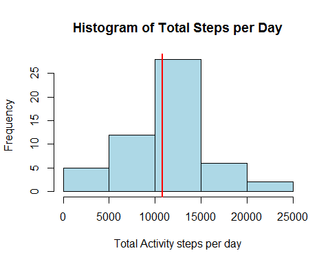
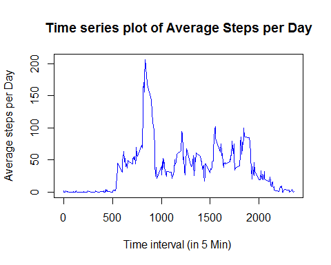

# Reproducible Research: Peer Assessment 1
 This is Peer Assessment -1 Work for 
 Reproduciable Research course on Coursera
 
 Created by: Bhaksar Bandaru

 Date: 17th May 2015


## Loading and preprocessing the data

Now we load the data 


```r
require (reshape2)
```

```
## Loading required package: reshape2
```

```r
require (ggplot2)
```

```
## Loading required package: ggplot2
```

```
## Warning: package 'ggplot2' was built under R version 3.1.3
```

```r
require (dplyr)
```

```
## Loading required package: dplyr
## 
## Attaching package: 'dplyr'
## 
## The following object is masked from 'package:stats':
## 
##     filter
## 
## The following objects are masked from 'package:base':
## 
##     intersect, setdiff, setequal, union
```

```r
unzip("activity.zip", exdir = ".",  overwrite=TRUE)
activitydf <- read.csv("activity.csv")
```
 

Now we do initial explrotation of the data


```r
names(activitydf) 
```

```
## [1] "steps"    "date"     "interval"
```

```r
dim (activitydf)
```

```
## [1] 17568     3
```

```r
head(activitydf,3)
```

```
##   steps       date interval
## 1    NA 2012-10-01        0
## 2    NA 2012-10-01        5
## 3    NA 2012-10-01       10
```

```r
tail (activitydf,3)
```

```
##       steps       date interval
## 17566    NA 2012-11-30     2345
## 17567    NA 2012-11-30     2350
## 17568    NA 2012-11-30     2355
```

```r
## now check the levels of the date

unique(activitydf$date)
```

```
##  [1] 2012-10-01 2012-10-02 2012-10-03 2012-10-04 2012-10-05 2012-10-06
##  [7] 2012-10-07 2012-10-08 2012-10-09 2012-10-10 2012-10-11 2012-10-12
## [13] 2012-10-13 2012-10-14 2012-10-15 2012-10-16 2012-10-17 2012-10-18
## [19] 2012-10-19 2012-10-20 2012-10-21 2012-10-22 2012-10-23 2012-10-24
## [25] 2012-10-25 2012-10-26 2012-10-27 2012-10-28 2012-10-29 2012-10-30
## [31] 2012-10-31 2012-11-01 2012-11-02 2012-11-03 2012-11-04 2012-11-05
## [37] 2012-11-06 2012-11-07 2012-11-08 2012-11-09 2012-11-10 2012-11-11
## [43] 2012-11-12 2012-11-13 2012-11-14 2012-11-15 2012-11-16 2012-11-17
## [49] 2012-11-18 2012-11-19 2012-11-20 2012-11-21 2012-11-22 2012-11-23
## [55] 2012-11-24 2012-11-25 2012-11-26 2012-11-27 2012-11-28 2012-11-29
## [61] 2012-11-30
## 61 Levels: 2012-10-01 2012-10-02 2012-10-03 2012-10-04 ... 2012-11-30
```

```r
##check for any missing values
summary(activitydf$steps)
```

```
##    Min. 1st Qu.  Median    Mean 3rd Qu.    Max.    NA's 
##    0.00    0.00    0.00   37.38   12.00  806.00    2304
```

```r
## now the percentage of the missing values are 
mean(is.na(activitydf$steps))
```

```
## [1] 0.1311475
```

```r
## The percentage of misssing values is statistically small 
```
##### The percentage of misssing values is statistically small 13%

## What is mean total number of steps taken per day?

Now calculate the Daily activity steps 


```r
## Now we would calculate the daily activity totals with out missing value 

sumbydate <- aggregate(steps ~ date, data= activitydf, sum)

dim (sumbydate)
```

```
## [1] 53  2
```

```r
head(sumbydate,3)
```

```
##         date steps
## 1 2012-10-02   126
## 2 2012-10-03 11352
## 3 2012-10-04 12116
```

```r
tail (sumbydate,3)
```

```
##          date steps
## 51 2012-11-27 13646
## 52 2012-11-28 10183
## 53 2012-11-29  7047
```

```r
##now the Mean and Median values
## mean value is 
mn <- mean (sumbydate$steps)
mn 
```

```
## [1] 10766.19
```

```r
##median value is 
md <- median (sumbydate$steps)
md
```

```
## [1] 10765
```
The mean value is 1.0766189\times 10^{4} and the median value is 10765 

now plot the histogram with the mean value

 

## What is the average daily activity pattern?

Now we want to calculate the average dauly activity in the time series of the interval


```r
## Now we would calculate the mean daily activity with the time interval 

meandaily <- aggregate(steps ~ interval, data= activitydf, mean)

dim (meandaily)
```

```
## [1] 288   2
```

```r
head(meandaily,3)
```

```
##   interval     steps
## 1        0 1.7169811
## 2        5 0.3396226
## 3       10 0.1320755
```

```r
tail (meandaily,3)
```

```
##     interval     steps
## 286     2345 0.6415094
## 287     2350 0.2264151
## 288     2355 1.0754717
```

```r
## Now get the max value of the average and the time period

maxvalue <- filter (meandaily, steps == max(steps))
maxsteps <- maxvalue$steps
maxint <- maxvalue$interval
## Maximum average steps
maxsteps
```

```
## [1] 206.1698
```

```r
## Interval at which the max average steps daily
maxint
```

```
## [1] 835
```

```r
## this provides the real conversion to Hours and Minutes
maxhr <- round (maxint/100)
maxhr
```

```
## [1] 8
```

```r
maxmin <- (maxint-maxhr*100)
maxmin
```

```
## [1] 35
```
The maximum average value is 206.1698113 and it happens at 8 Hours and 35 Minutes

Now create the time series plot
 
 


## Imputing missing values

##### Now here we do the Imputing the Missing values in the dataset


## Are there differences in activity patterns between weekdays and weekends?
